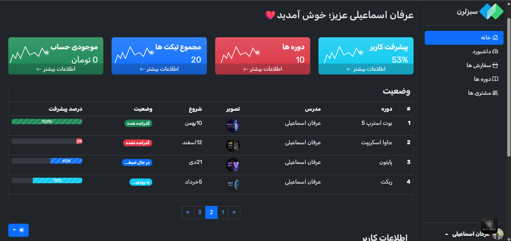
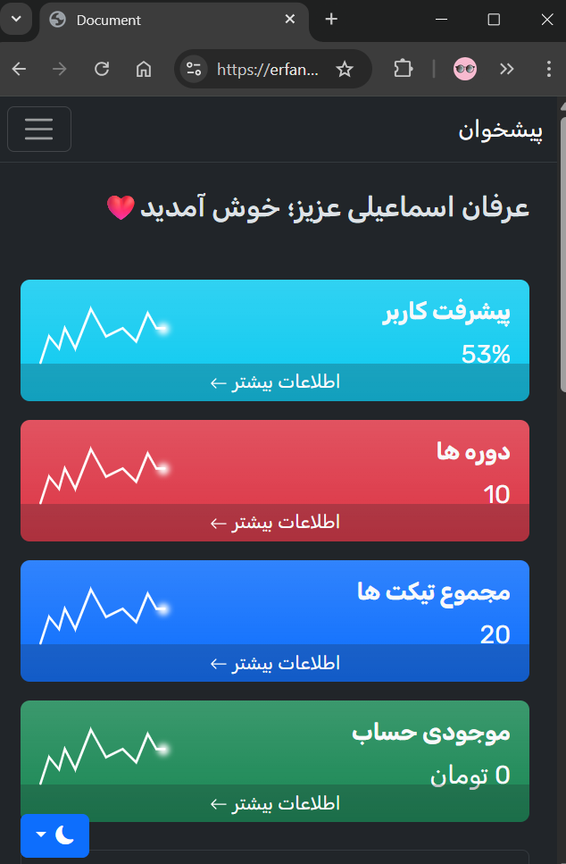
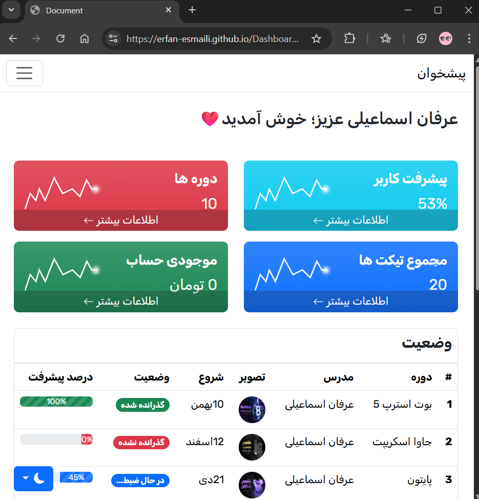

# Dashboard Admin

>

## 🔧 Features

- 🌓 **Dark Mode Support**
- 🛠️ **Admin Controls** 
- 📱 **Fully Responsive** 
- 📊 **User Dashboard** 

## ⚙️ Technologies Used

## 📷Screenshots

### 🌒Dark mode

###  ☀️light mode

 

##  📱Responsive

